# Pizzería - Mamma Mia!

¡Bienvenido al repositorio de nuestro proyecto Pizzería! Este proyecto se está construyendo paso a paso como parte de los desafíos del Bootcamp de React.

## Índice
1. [Fase 1: Creación del proyecto y primeras vistas](#fase-1-creación-del-proyecto-y-primeras-vistas)
2. [Fase 2: Componentes de Register y Login](#fase-2-componentes-de-register-y-login)
3. [Fase 3: Componentes estáticos y dinámicos (Home y Cart)](#fase-3-componentes-estáticos-y-dinámicos-home-y-cart)
4. [Fase 4: Consumo de API (Home y Pizza)](#fase-4-consumo-de-api-home-y-pizza)
5. [Fase 5: Enrutamiento con React Router](#fase-5-enrutamiento-con-react-router)
6. [Fase 6: Manejo de estado global con Context API](#fase-6-manejo-de-estado-global-con-context-api)
7. [Fase 7: Rutas protegidas y Context de Usuario](#fase-7-rutas-protegidas-y-context-de-usuario)
---

## Fase 1: Creación del proyecto y primeras vistas

En esta fase inicial, configuramos la base del proyecto utilizando Vite y creamos la estructura fundamental de la aplicación. Se implementaron los componentes estáticos principales que definen la vista principal o *Home*:

- **Navbar**: Barra de navegación superior.
- **Header**: Cabecera principal con información destacada.
- **Home**: Vista principal que muestra las opciones de pizzas.
- **Footer**: Pie de página de la aplicación.

### Capturas de la vista Home (Fase 1)
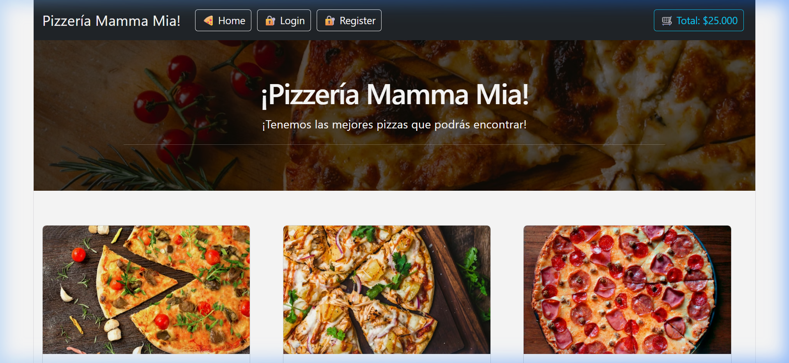
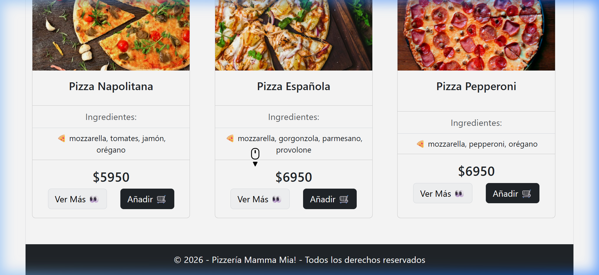

---

## Fase 2: Componentes de Register y Login

En la segunda fase, nos enfocamos en la creación de los formularios de autenticación para los usuarios.

- **Register**: Formulario de registro con validaciones de contraseñas.
- **Login**: Formulario de inicio de sesión básico.

### Captura de la vista Register
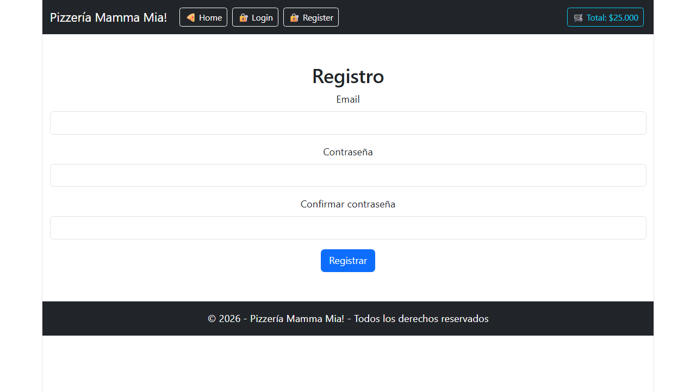

### Captura de la vista Login
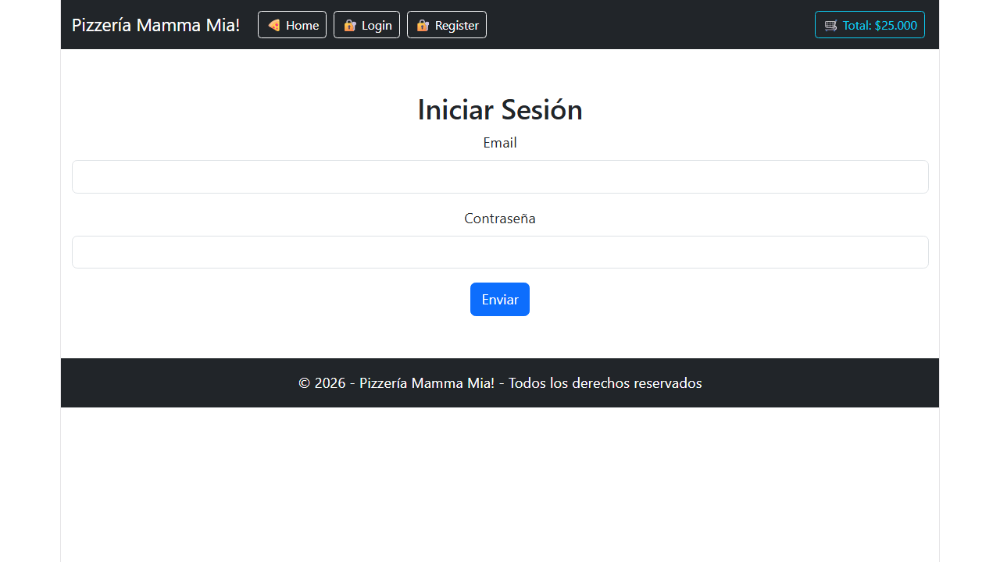

---

## Fase 3: Componentes estáticos y dinámicos (Home y Cart)

En esta tercera fase, nos enfocamos en refactorizar la vista Home para que consuma datos dinámicos y en crear la vista del carrito de compras.

- **Home**: Refactorizada para importar el arreglo de pizzas desde `pizzas.js` y renderizar dinámicamente los componentes `CardPizza`.
- **CardPizza**: Componente actualizado para recibir datos de cada pizza mediante *props* y renderizar su información de forma dinámica.
- **Cart**: Nuevo componente que simula un carrito de compras. Muestra los detalles de las pizzas agregadas, permite aumentar o disminuir la cantidad y calcula el precio total automáticamente.

### Captura de la vista Home (Fase 3)
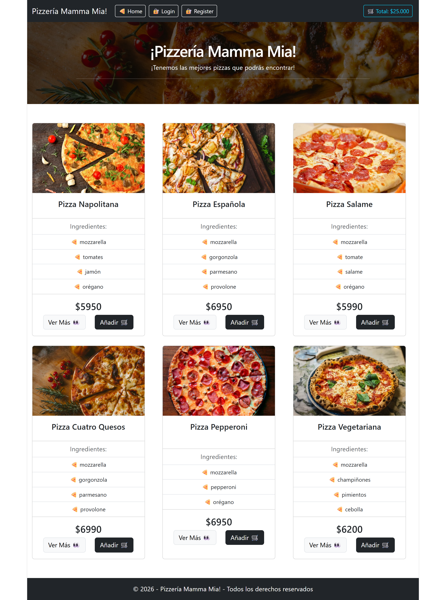

### Captura de la vista Cart
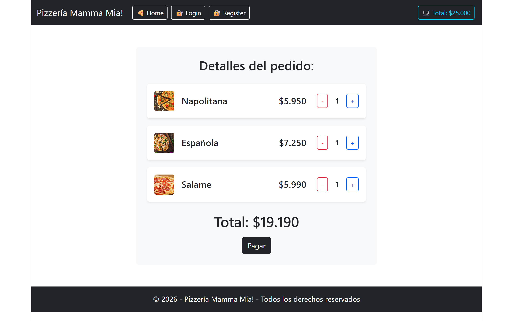

---

## Fase 4: Consumo de API (Home y Pizza)

En esta fase, integramos una API para obtener la información de las pizzas de forma dinámica en lugar de utilizar el arreglo local estático.

- **Home**: Se modificó para consumir el endpoint `http://localhost:5000/api/pizzas` mediante `useEffect` y `fetch`.
- **Pizza**: Se creó un nuevo componente que consume un endpoint dinámico (ej. `http://localhost:5000/api/pizzas/p001`) para mostrar en detalle la información de una sola pizza.

### Captura de la vista Pizza (Consumo de API)
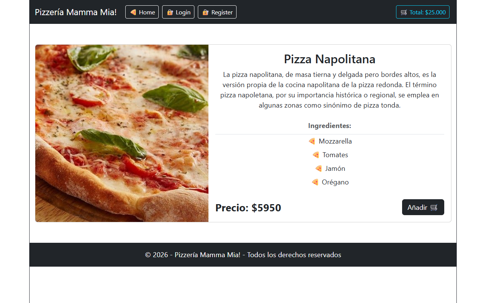

---

## Fase 5: Enrutamiento con React Router

En esta fase, configuramos las rutas del proyecto y la navegación utilizando `react-router-dom`:

- **Navegación general**: Implementada en `App.jsx` con rutas para `Home`, `Register`, `Login`, `Cart`, `Pizza`, `Profile` y `NotFound`.
- **Navbar**: Actualizada con enlaces de navegación para navegar entre vistas sin recargar la página.
- **Profile**: Componente de vista de usuario con email estático y opción para poder cerrar sesión.
- **NotFound**: Componente para manejar las rutas inexistentes de forma amigable, permitiendo al usuario volver al inicio.

### Capturas del enrutamiento

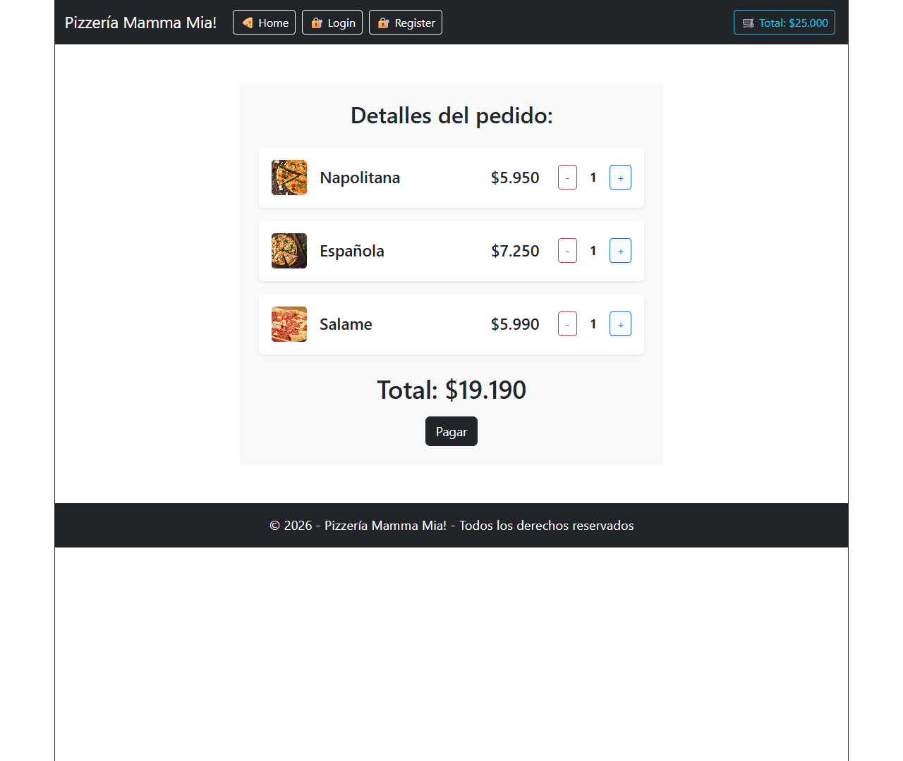
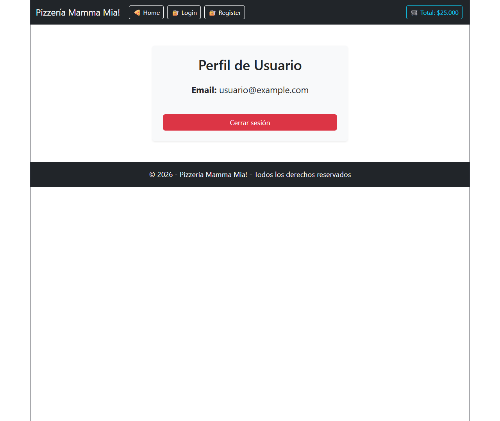
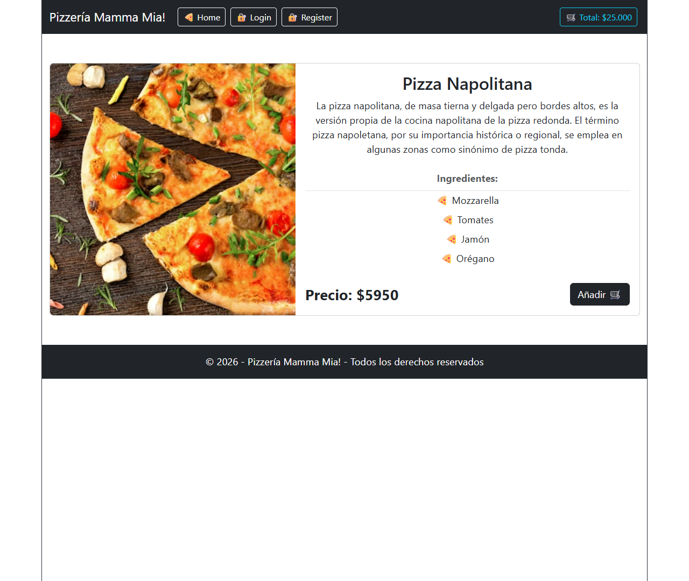
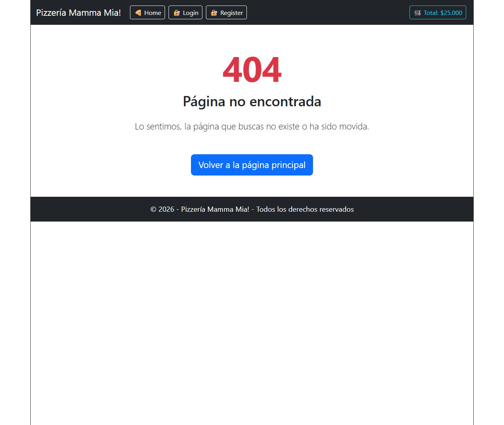

---

## Fase 6: Manejo de estado global con Context API

En esta fase, implementamos el manejo del estado global de la aplicación web utilizando Context API:

- **CartContext**: Creado para manejar el estado del carrito de compras de forma global. Provee las variaciones para añadir productos (`addToCart`), aumentar su cantidad (`increaseQuantity`), disminuirla (`decreaseQuantity`) y calcula el precio total de manera automática.
- **Navbar**: Actualizada para consumir el `CartContext` y mostrar dinámicamente el precio total del carrito de compras actualizado en tiempo real en toda la aplicación.
- **Añadir al carrito**: En las vistas `Home` y `Pizza`, el botón "Añadir 🛒" fue enlazado directamente al context, permitiendo agregar elementos al carrito desde distintos lugares.
- **Cart**: La página del pedido fue refactorizada por completo para alimentarse dinámicamente desde el `CartContext`, permitiendo ajustar cantidades y reflejando el total consistentemente.
- **PizzaContext (Opcional)**: Adicionalmente, creamos un contexto opcional que maneja la centralización y consumo (*fetch*) del listado general de pizzas proveniente de la API, optimizando el renderizado en la página central.

---

## Fase 7: Rutas protegidas y Context de Usuario

En esta fase avanzamos implementando parámetros dinámicos, rutas protegidas y la gestión global de usuarios:

- **UserContext**: Implementamos un estado global que mantiene la sesión de usuario activa (`token`) y las funciones correspondientes, como el método `logout`. 
- **Navbar**: Conectada con `UserContext`. Renderiza de manera condicional los botones (Profile y Logout vs. Login y Register) dependiendo del estado del token del usuario.
- **Rutas Protegidas**: Integradas en `App.jsx` mediante el componente `Navigate`. Restringimos el acceso a `/profile` redirigiendo a `/login` si no hay sesión. Asimismo, evitamos que un usuario ya logueado pueda entrar a `/login` o `/register`, redirigiéndolo al *Home*.
- **useParams**: Se implementó en `Pizza.jsx` para extraer el ID de la URL y obtener dinámicamente desde el endpoint la información individual de la pizza seleccionada. En `CardPizza`, el botón se actualizó a `<Link>` para redirigir a esta vista.
- **Validación en Cart**: El botón "Pagar" dentro del carrito de compras fue deshabilitado (`disabled`) para los usuarios que no han iniciado sesión.
